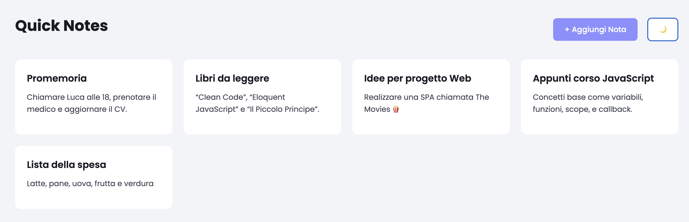
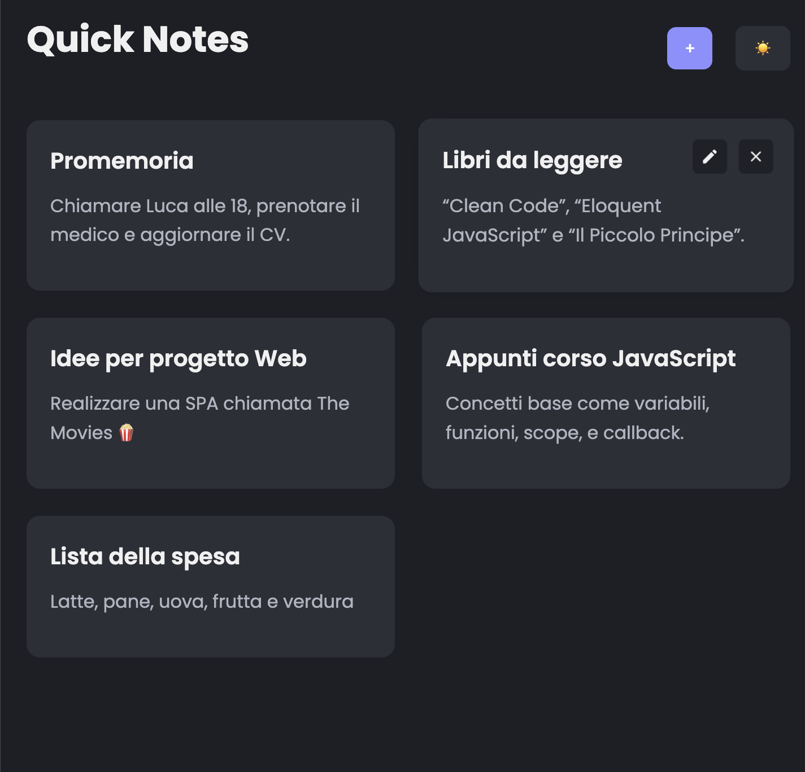

# Quick Notes 📝

**Quick Notes** è una semplice applicazione web per prendere appunti veloci, sviluppata con **HTML5**, **CSS3** e **JavaScript** vanilla.  
L’app permette di aggiungere, modificare ed eliminare note, con salvataggio locale tramite `localStorage` e supporto a tema chiaro/scuro.

🔗 **Demo live:** [https://quick-notes-nine.vercel.app/](https://quick-notes-git-main-luca-conigliaros-projects.vercel.app)

---

## ✨ Caratteristiche principali

- Aggiunta e modifica rapida delle note
- Salvataggio automatico nel browser tramite `localStorage`
- Tema chiaro/scuro con toggle e memorizzazione della preferenza
- Interfaccia responsive, ottimizzata per desktop, tablet e smartphone
- Gestione di stati vuoti (nessuna nota presente)

---

## 🧑‍💻 Tecnologie utilizzate

- **HTML5** – Struttura semantica e accessibile
- **CSS3** – Styling con variabili CSS e media query per il responsive design
- **JavaScript (vanilla)** – Logica per gestione note, salvataggio, tema e interazione
- **LocalStorage** – Persistenza dati lato client

---

## 📦 Installazione e utilizzo

1. Clona il repository:

   ```bash
   git clone https://github.com/lucaconigliaro/Quick-Notes

2.	Apri index.html in un browser moderno oppure usa un server locale (es. Live Server per VSCode).
3.	Usa l’interfaccia per aggiungere, modificare o eliminare note.
4.	Cambia tema cliccando sull’icona in alto a destra.

---

## 📸 Screenshot
**Home** 



**Aggiungi Nota**
   

*(Screenshots disponibili nella cartella `screenshots/`)*

---

## 📍 Obiettivo del progetto

Quick Notes è stato creato per:
	•	Approfondire la gestione dello stato e la manipolazione del DOM in JavaScript puro
	•	Implementare un’interfaccia utente semplice, intuitiva e responsive
	•	Praticare il salvataggio persistente dati tramite localStorage
	•	Sperimentare il tema scuro e la gestione dinamica dei contenuti

---

## 👨🏻‍💻 Autore

**Luca**  
Jr. Frontend Developer  
[LinkedIn](https://www.linkedin.com/in/luca-conigliaro-5636b1352/) • [GitHub](https://github.com/lucaconigliaro)  
